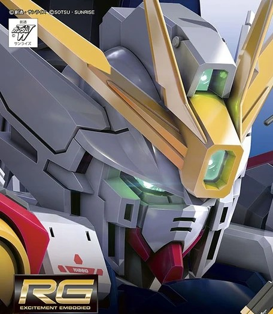

```zsh
> boot_sequence --mobile-suit wing-zero
```



```yaml
DjaluG@github
━━━━━━━━━━━━━━━━━━━━━━━━━━━━━━━━━━━━━━━
MODEL: XXXG-00W0 Wing Gundam Zero
SYSTEM: ZERO System Interface
PILOT_ROLE: Fullstack Engineer / AI Automation / RPA Developer

STACK:
  Framework : React • Next.js • SolidJS • Tailwind • Node.js • NestJS • Express • FastAPI • etc
  DB : PostgreSQL • MySQL • MongoDB • Firebase
  AI : n8n • UiPath • LangChain • OpenAI • RAG
  Web: TypeScript • JavaScript • Python • PHP

FOCUS:
  - AI Agents
  - Workflow Automation
  - Data Engineering
  - Financial Systems

INTEREST:
  - Model Kit
  - Gaming
  - 3D Design

*"Life is cheap, especially mine"*
```
